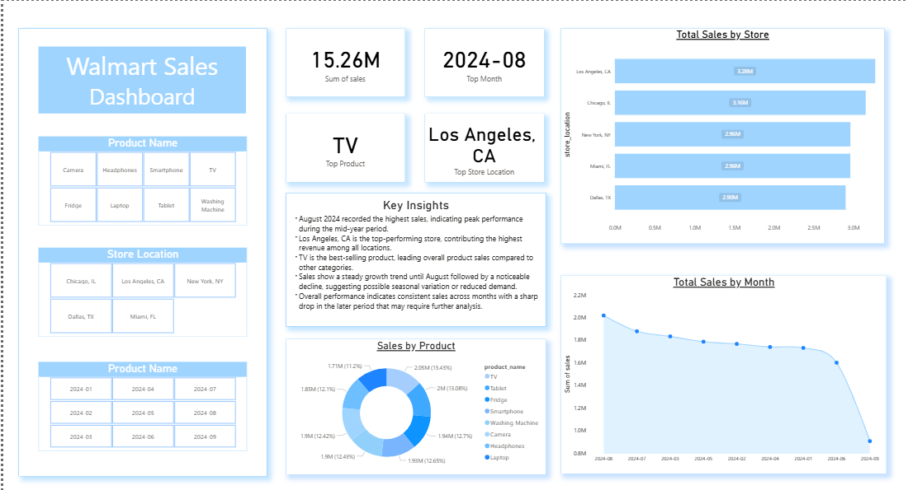

# Walmart Sales Dashboard (SQL + Power BI)

## Overview
This project analyzes Walmart sales data using SQL for data processing and Power BI for visualization.  
The dashboard focuses on identifying key trends in sales, top-performing products, and store locations.

## Tools Used
- SQL (MySQL)
- Power BI

## Process
- Cleaned and formatted raw data (handled date format issues)
- Created SQL views for structured analysis
- Loaded processed data into Power BI
- Built an interactive dashboard with KPIs, charts, and filters

## Dashboard Features
- KPI Cards for Total Sales, Top Month, Top Product, and Top Store Location  
- Monthly sales trend analysis  
- Store-wise sales comparison  
- Product-wise sales distribution  
- Interactive filters for product, store location, and date  

## Key Insights
- August 2024 recorded the highest sales (~15M), indicating peak performance  
- Los Angeles, CA is the top-performing store location  
- TV is the highest-selling product  
- Sales show a gradual decline after August, suggesting possible seasonality  
- Sales distribution across products shows a few key products driving most revenue  

## Files in this Repository
- `queries.sql` → SQL queries and views used for analysis  
- `sales_data.csv` → Dataset used for the project  
- `dashboard.pbix` → Power BI dashboard file  
- `images/dashboard.png` → Dashboard preview  

## Dashboard Preview

## Note
This project was created as part of my data analysis learning journey, combining SQL for backend processing and Power BI for building interactive dashboards.
